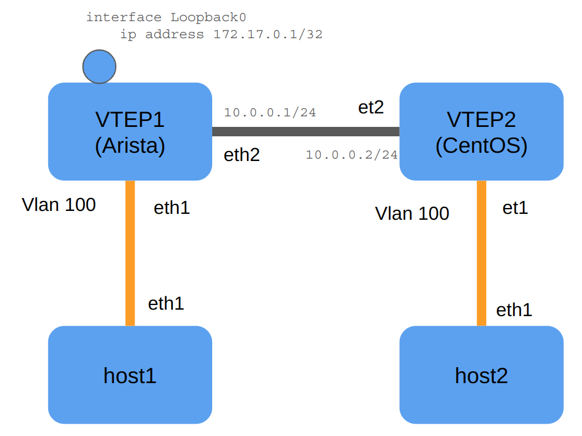

# arista-centos-vxlan
A lab to demonstrate how to create a VxLAN tunnel between an Arista device and a CentOS server using containerlab.
## Topology


## To run on the CentOS host

### Packages to install
```
# for ip link commands
yum install -y iproute

# optional: for packet capture on CentOS side
yum install -y tcpdump
```

### Physical interface setup
```
ip addr add 10.0.0.2/24 dev et2
ip route add 172.17.0.1/32 via 10.0.0.1
```
### Vxlan setup
```
ip link del vxlan1
ip link add vxlan1 type vxlan id 10000 remote 172.17.0.1 local 10.0.0.2 dstport 4789 dev et2
bridge fdb append 00:00:00:00:00:00 dev vxlan1 dst 172.17.0.1
ip link set up dev vxlan1

ip link add br-vxlan1 type bridge
ip link set dev vxlan1 master br-vxlan1
ip link set dev et1 master br-vxlan1 
ip link set dev br-vxlan1 up
```


### Verification
#### On VTEP2: 
```
# ip -d link show vxlan1
# ip -d link show br-vxlan1
# ip -d link show et1

# bridge fdb show dev vxlan1   
00:00:00:00:00:00 dst 172.17.0.1 via et2 self permanent
00:00:00:00:00:00 dst 172.17.0.1 self permanent

# bridge link
21: et1 state UP @(null): <BROADCAST,MULTICAST,UP,LOWER_UP> mtu 9500 master br-vxlan1 state forwarding priority 32 cost 2 
2: vxlan1 state UNKNOWN : <BROADCAST,MULTICAST,UP,LOWER_UP> mtu 9450 master br-vxlan1 state forwarding priority 32 cost 2
```


### On host 1: 
```
# ping 192.168.0.1
```

### On ceos-vtep1:
```
# show int vxlan1
# show ip route 
# ping 10.0.0.2
```